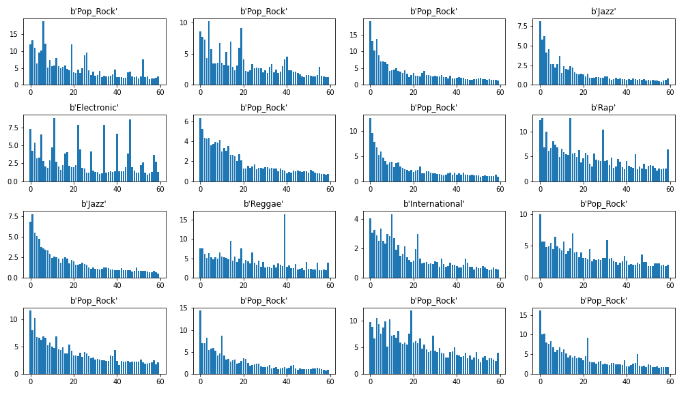

# ML Project : Music Recommendation and Genre Classification
Spring 2022 \\
Group Members: Sichen Jin, Jiachen Ren, Antoine Rollet, Adriana Vega Fernández, Robert Ward
## Proposal Video
<iframe width="560" height="315" src="https://www.youtube.com/embed/19_zbvP8lSg" title="YouTube video player" frameborder="0" allow="accelerometer; autoplay; clipboard-write; encrypted-media; gyroscope; picture-in-picture" allowfullscreen></iframe>

## Introduction & Background 
Spotify has since become the most popular streaming music service, boasting more than 180M paid subscribers. Spotify achieved this position through its high-quality playlists based on listening habits (what you like, share, save, skip) and the listening habits of others with similar tastes. The user experience is personalized with algorithmically curated playlists like Discover Weekly and Release Radar and is now the base of their business model. Our project aims to replicate several tools Spotify uses to curate their playlists.

## Problem Definition
We wish to solve two separate but related problems. First, we will build a music genre classifier that classifies a track based on its audio features.  Next, we aim to build a recommendation system that would recommend songs to complete a playlist (given a list of songs already in the playlist, we predict the rest). The ground truth labels for both are provided by Spotify's Million Playlist Dataset and API. 

## Methods
### Dataset
We will use <a href="https://www.aicrowd.com/challenges/spotify-million-playlist-dataset-challenge" title="MPD">The Million Playlist Dataset (MPD)</a>, a dataset of 1 million playlists from Spotify. In this dataset, each playlist contains a list of song IDs and general information about the song. Using Spotify's [API](https://developer.spotify.com/documentation/web-api/reference/#/operations/get-several-audio-features), we will retrieve precomputed audio features such as `liveness`, `loudness`, `energy`, etc., for supervised and unsupervised learning tasks. In addition, we will use Spotify's API to retrieve raw audio samples of a subset of songs. 
#### Midterm Update 

##### Data Collection

We downloaded the Million Playlist Dataset. We had to do some data pre processing because the dataset is very large and there were some information that we demmed not useful. Like the creation date of the playlist and the number of songs per playlist. We figured they would be redundant. We stored them as JSON files in our colab environment so everyone could have access to them. We kept only the tracklist for each playlist. 

We used Spotify's API to recover the audiofeatures for each track. Spotify limits the number of requests one can make per day, since our dataset contains over 2 million tracks, this took some time to gather, even with multiple developper accounts. We also acquiered artist information, like the different genres one artist is assigned to. However, we could not use this yet because we are interested in the genre for a particular track. We know that there is the [tagtraum genre annotations for the Million Song Dataset](https://www.tagtraum.com/msd_genre_datasets.html) which contains manual annotations for the genre of a particular track. This is a work in progress, it could be very helpful four our clustering task.

### Unsupervised Learning

Genre classification: We aim to perform K-Means clustering on the selected audio features of songs. Given a set of songs and their corresponding genre label (with k genres total), we will cluster them into k clusters based on audio features in the Euclidean space. We will simply compare the distance between the audio features of new songs and the learned cluster centers to make genre predictions.

#### Final Update

##### Data Exploration
One of the first analysis to perform on a machine learning project is to explore the dataset. Make sure the dataset is clean. That all values are in the expected formats, decide how to handle missing values and more. 

When it comes from the features dataset recovered from the Spotify API, the dataset is very clean with no missing values. The table below is a brief description of each feature according to the Spotify documentation.

| Feature          | Type    |  Description                                                                                           |
| ---------------- | ------- | ------------------------------------------------------------------------------------------------------ |
| acousticness     | float   | A confidence measure from 0.0 to 1.0 of whether the track is acoustic                                  |
| analysis_url     | string  | A URL to access the full audio analysis of this track. An access token is required to access this data |
| danceability     | float   | Danceability describes how suitable a track is for dancing based on a combination of musical elements  |
| duration_ms      | integer | The duration of the track in milliseconds                                                              |
| energy           | float   | Energy is a measure from 0.0 to 1.0 and represents a perceptual measure of intensity and activity      |
| loudness         | float   | The overall loudness of a track in decibels (dB)                                                       |
| id               | string  | The Spotify ID for the track                                                                           |
| instrumentalness | float   | Predicts whether a track contains no vocals                                                            |
| key              | integer | The key the track is in. Integers map to pitches using standard Pitch Class notation                   |
| liveness         | float   | Detects the presence of an audience in the recording                                                   |
| mode             | integer | Mode indicates the modality (major or minor) of a track                                                |
| time_signature   | integer | An estimated time signature, meter. It specifies how many beats are in each bar (measure)              |
| speechiness      | float   | Speechiness detects the presence of spoken words in a track                                            |
| tempo            | float   | The overall estimated tempo of a track in beats per minute                                             |
| track_href       | string  | A link to the Web API endpoint providing full details of the track.                                    |
| type             | string  | Allowed value: "audio_features"                                                                        |
| uri              | string  | The Spotify URI for the track                                                                          |
| valence          | float   | A measure from 0.0 to 1.0 describing the musical positiveness conveyed by a track                      |

There are some features that will be useless to our analysis because they are unique or equal to every data point : type, uri, analysis_url, id and track_href are to be removed from our dataset when performing an algorithm. That leaves us with 13 features. We use a MinMax scaler so that all of the values are within 0 and 1.

We then proceeded to analyze the distribution of each feature and their correlation :

We can see that the mode, key and time_signature are only allowed to take few discrete values. This could be a problem when performing dimensionality reduction or any clustering algorithm. 

We can see that some features are positively correlated : danceability and energy, energy and tempo. This was to be expected as per the descriptions above. 

#### PCA
Data visualization is very important in any project. It allows us to better understand our raw data and also our results. PCA is a dimensionality reduction algorithm that seeks to find a new space in which the variance of our data is maximized. After having implemented the PCA algorithm, the total variance explained by the first two principal components (we choose two so that it may be visualized), only explain 0.284 and 0.247 respectively. This means that we are losing a lot of information when only using the first two components. It is not ideal, more research needs to be made. 

Nonetheless, we can observe an interesting phoenomenon when we polt our components. Since our dataset is very large (>2M songs), we chose to sample 1000 points at random for visibility purposes. 

We can see a bimodal distribution in our data and we decided to investigate it further, since the original features no longer exist in the PCA space, we decided to perform a clustering algorithm and then analyse the distribution of our data for each feature, in each cluster. 

#### K-Means
We decided to perform the K-Means algorithm on our entire dataset. Since we have a very big dataset with many dimensions and K-Means is a distance based algorithm this was quite time consuming. 

Since we saw during the PCA implementation that there was a bimodal distribution in our data, we performed the algorithm to find 2 clusters. 

We can see that the only feature that seems to be clearly separated by the cluster is the mode. We decided to remove this feature and perform clustering algorithms on the dataset. After performing PCA on our new dataset, we get a total explained variance of 53%. We sampled 5000 points and this is the visualization result of the data in the PCA space :

We performed KMeans with a varying number of clusters and plotted the inertia accordingly to select the optimal k :

The optimal number of clusters seems to be between 3 and 4. We choose k=3 and apply the KMeans algorithm. This is the final output in the PCA space: 

The separation is not what we would expect, it seems to be uniformely dividing the space. To further understand what separates the clusters we proceeded to plot the distribution of each feature, for eah cluster :

We can see that cluster 0 and cluster 1 are clearly separated in terms of energy, danceability, time signature, acousticness and loudness. Cluster 0 regroups acoustic songs, slower songs like balads whereas cluster 1 regroups dance songs, high tempo and energy : party songs. Cluster 3 is not identifyiable. 

We decided to try DBSCAN on our dataset. DBSCAN is a Density Based clustering method, it has the advantage of figuring out the number of clusters in the data. It has two input parameters : epsilon and MinPts. it is much more sensible to epsilon. To find the optimal value for this parameter we polot the average distance to the 4th nearest neighbor for every point in the dataset. The optimal value is at the point of maximal curvature : 

We set epsilon=0.00075 and MinPts=10. The results are not very promising, the algorithm doesn't handle varying density clusters very well, here we have over 10000 clusters. After dropping the noise points, this is DBSCAN output :

However, there is one high density cluster: cluster 1. We can see it in purple in the figure above. After analysis we can see that this cluster has very similar distribution to cluster 1 in KMeans. This leads us to believe that high energy, party songs are overwhelmingly more present in this dataset

In order to confirm our hypothesis, we take all the ids from the songs in this high density cluster and we match the ids to the track information. 
The dataset contains a field named "popularity" ranked in a scale of 0 to 100. We sort the songs from most to least popular and the top 10 most popular songs in this cluster are :

|Song Title | Artist | Popularity |
|-----------|--------|------------|
|Infinity   |Jaymes Young| 95 |
|Sweater Weather|The Neighbourhood| 92|
|Dandelions |Ruth B.|91|
|Without Me |Eminem|89|
|Ginseng Strip 2002|Yung Lean	| 88|
|The Real Slim Shady|Eminem|88|
|The Nights |Avicii| 88|
|goosebumps |Travis Scott	|87|
|Classic    |MKTO|86|
|In The End |Linkin Park|86|

We can see that in addition to being fatser, high tempo songs they are also very popular. This cluster could also be tied to the songs popularity. But we do not have time within the time frame for this project to pursue this idea. 

### Supervised Learning
##### Song embeddings based on playlists

The idea of this approach is to produce embeddings for each song, and run inference with a Nearest Neighbor search, using an aggregate of the embeddings as the query to find potential new candidates to fill the playlists. Each model is trained using an Embedding layer and a network on various tasks hoping to create interesting features for the songs (the Embedding layer). Data used to train them is simply the playlists data.

Playlists used for example: #1: [1, 2, 4], #2: [3, 5, 6], #3: [7, 8]

| Model name                                                                                                                 | Task Description                                                                                              | Input example | Output example |
|----------------------------------------------------------------------------------------------------------------------------|----------------------------------------------------------------------------------------------------------|---------------|----------------|
| Discriminative          | Feeding the model an input of song_ids and outputing whether each belong to a same playlist or not.      | [1, 3, 2, 7] | [1, 0, 1, 0]
| Binary discriminative                                                                                                      | Feeding the model an input of song_ids and outputing if it's a playlist or not                           | [1, 3, 7] / [1, 2, 4]   | 0 / 1
| Last song                                                                                                                  | Predicting a song_id of the playlist based on the other ones                                             |   [1,4] | 2
| Last song with aggregate                                                                                                   | Predicting a song_id of the playlist based on the other ones but here embeddings of input are aggregated |   [6,5] | 3

##### Custom Embeddings Results

| Metrics                      | Discriminative model     | Binary Discriminative model | Last Song model | Last song with aggregate |
|------------------------------|--------------------------|-------- | --- | --- |
| Task accuracy                | 99.3%                    |  97.2%    | 73.1%             | 45.7% |
| Inference accuracy (top-20)  | 0.0%                     | 0.0%    | 0.1%              | 0.0% |
| Inference accuracy (top-500) | 0.4%                     | 0.0%    | 0.9%              | 0.1% |

For now, we have not yet been able to achieve good results. Part of the problem is that the feature we are trying to create is very large (there is over 2M songs) and thus embeddings created are not yet accurate enough. Further improvements will include implementing a model similar to the Nearest Neighbor algorithm and try to make use of RNN layers.  
## Playlist completion
After trying to create embeddings usable by a Nearest Neighbor algorithm without success, we went to a more simple approach of directly predicting next songs in the playlists.
All work here has been performed with Google Colab Pro.
### Models
We tested 3 different Neural Networks architecture that are commonly used, that are made of (1) an Embedding layer, (2) a Feature extraction layer and (3) a Classifier layer.
Models differ by their feature extraction layer:
- Conv Model: we used a convolutional layer with a kernel size of 5
- RNN Model: we used a bidirectional GRU layer
- Transformer Model: We used a Transformer Encoder with 2 Multihead Attention with 4 heads

Embedding layer has a dimension of 512 and the classifier layer is two fully connected layers with a hidden size of 512.
### Data preparation

We have had a lot of compromises to do with our data for usability and efficiency reason.
1. First, out of the 1 million original playlist, we could only use 400k for training because more would not fit into memory. This was randomly sampled.
2. In 400k playlists we had over 1.6 million unique songs. This was raising 2 problems: as we will see later we create an Embedding layer. Such Embedding matrix would take $n\_songs\times embedding\_size \times float64 memory = 1.6\times 10^6 \times 512 \times 8 bytes = 6.5 GB$ memory. This is more than half half of the GPU RAM on Colab (12GB). Second problem is that if we consider each song as a potential class, it results in a classification task with too many labels. To tackle both these issues, we chose to select the 50k songs that appeared the most in the playlists.
3. Resulting from previous point, we removed all songs that are not in the top 50k from the playlists. We removed completely all playlists that had a new size less than 5.
4. Our models will require a fixed input size (known as padding size). To build our dataset, we select randomly a label, take a sample of maximum padding size of the other songs as input, and eventually pad it to the desired padding size if needed. Since we have randomness, we rebuild the dataset at each epoch to prevent overfitting.

### Experimental settings
To train these networks we used an Adam optimizer with:
- 20 epochs
- a batch size of 64
- a learning rate of 1e-4
- a Cross Entropy Loss

### Results

#### Training

#### Models

|                  | Conv Model | RNN Model | Transformer Model |
|------------------|------------|-----------|-------------------|
| # of parameters  | 53M        | 60M       | 352M              |
| Final Test loss  | 9.502      | 10.111    | 11.328            |
| Top-100 accuracy | 15.5%      | 0.5%      | 13.4%             |
| Top-500 accuracy | 31.4%      | 2%        | 28.1%             |

#### Graph-based approach

Neural network collaborative filtering for playlist completion:
We are exploring some graph-based approaches for playlist completion: the basic idea is to first derive the songs-playlists bipartite graph from the dataset, then use  the methods from common graph neural network and collaborative filtering (NGCF) (2) to learn the graph embeddings of songs and playlists based on observed interactions and make prediction.  
The model is built on top of GNNs, which aims to capture the collaborative signal as well as graph structure between music and playlist. The design of the network is first construct the music-playlist bipartite graph, then concatenate the embeddings of music and playlist from different levels of propagations of GNN layers to construct the final embedding of music and playlist.  For prediction, the inner product of learned playlist embeddings and music embeddings are used to calculate the preference of one playlist to a specific song. For optimization, the negative labels are unseen combinations among music and playlist while the positive labels are observed pairs of music and playlist. We tried to use 80% of the dataset for training and the rest for testing. However, the training process for this model is time consuming especially for the propagation part, by the end of the midterm due, the training process is still undergoing. Later we will try to lower the propagation level and then take advantage of other training resources to speed up the training process.

#### Genre classification

For genre classification, the ground truth labels are obtained from [MSD Allmusic Top Genre Dataset (Top-MAGD)](http://www.ifs.tuwien.ac.at/mir/msd/download.html), a subset of Million Song Dataset. This dataset contains ground truth genre classifications of 406427 songs from the MSD in 13 genres. Below is a table of distribution of the ground truth labels over 13 genres:

| Genre Name    | Number of Tracks |
|---------------|------------------|
| Pop/Rock      | 238786           |
| Electronic    | 41075            |
| Rap           | 20939            |
| Jazz          | 17836            |
| Latin         | 17690            |
| R&B           | 14335            |
| International | 14242            |
| Country       | 11772            |
| Reggae        | 6946             |
| Blues         | 6836             |
| Vocal         | 6195             |
| Folk          | 5865             |
| New Age       | 4010             |

To establish a baseline, we created a simple classifier [SimpleRHClassifier](genre_classification/classifiers.py) with only 2 hidden layers. Layers are fully-connected with relu activation in between, and each hidden layer contains 100 neurons. The input feature is the **rhythm histogram** for each song, which is a 60-dimensional feature vector that describes general rhythmic patterns of an audio. The bins of the histogram span over modulation frequency between 0 and 10 Hz, which together forms a representation of the song's rhythmic energy. The output is a probability distribution over 13 genres that the model predicts. To get a better sense of what the rhythm histogram looks like, we created the following visualization of 16 samples randomly chosen from the dataset:

We split the 406427 songs into training and testing sets by an 8:2 raio, and trained `SimpleRHClassifier` using SGD as optimizer with a learning rate of 0.0001 over 5 epochs. With this, we achieved a classification accuracy of 0.58 on the testing set, which we establish as the baseline. Training code is found [here](genre_classification/classification.ipynb).

#### Further work

Supervised Learning:
LSTM/RNN for genre prediction: To improve from the baseline, we will train an LSTM over more advanced features. The model will consist of several recurrent layers followed by linear layers. The rationale is to use the cell state (or hidden state) from the last recurrent layer as a learned embedding of the audio sample, and then use the subsequent linear layers to classify the embedding into the correct genre label.

Sequential model for playlist completion: We will train a sequential model based on an attentive neural architecture incorporating song features (4).

Graph-based approach for playlist completion: We will train GraphSAGE (5) for playlist completion.

## Conclusion
Our project has two goals - genre classification and playlist completion. We will compare the results of different models that pertain to the same task based on their performance in terms of their precision, accuracy, and other metrics. These evaluations will help us understand what works the best.

## References
1. van Niedek, Timo, and Arjen P. de Vries. "Random walk with restart for automatic playlist continuation and query-specific adaptations." Proceedings of the ACM Recommender Systems Challenge 2018. 2018. 1-6.
2. Wang, Xiang, et al. "Neural graph collaborative filtering." Proceedings of the 42nd international ACM SIGIR conference on Research and development in Information Retrieval. 2019.
3. He, Xiangnan, et al. "Lightgcn: Simplifying and powering graph convolution network for recommendation." Proceedings of the 43rd International ACM SIGIR conference on research and development in Information Retrieval. 2020.
4. Sachdeva, Noveen, Kartik Gupta, and Vikram Pudi. "Attentive neural architecture incorporating song features for music recommendation." Proceedings of the 12th ACM Conference on Recommender Systems. 2018.
5. Hamilton, Will, Zhitao Ying, and Jure Leskovec. "Inductive representation learning on large graphs." Advances in neural information processing systems 30 (2017).

## Appendix
Download GANTT chart [here](https://docs.google.com/spreadsheets/d/1eBinr-KAz04P-j1TpmxQwzl0uz0aNe7P/export?format=xlsx).
